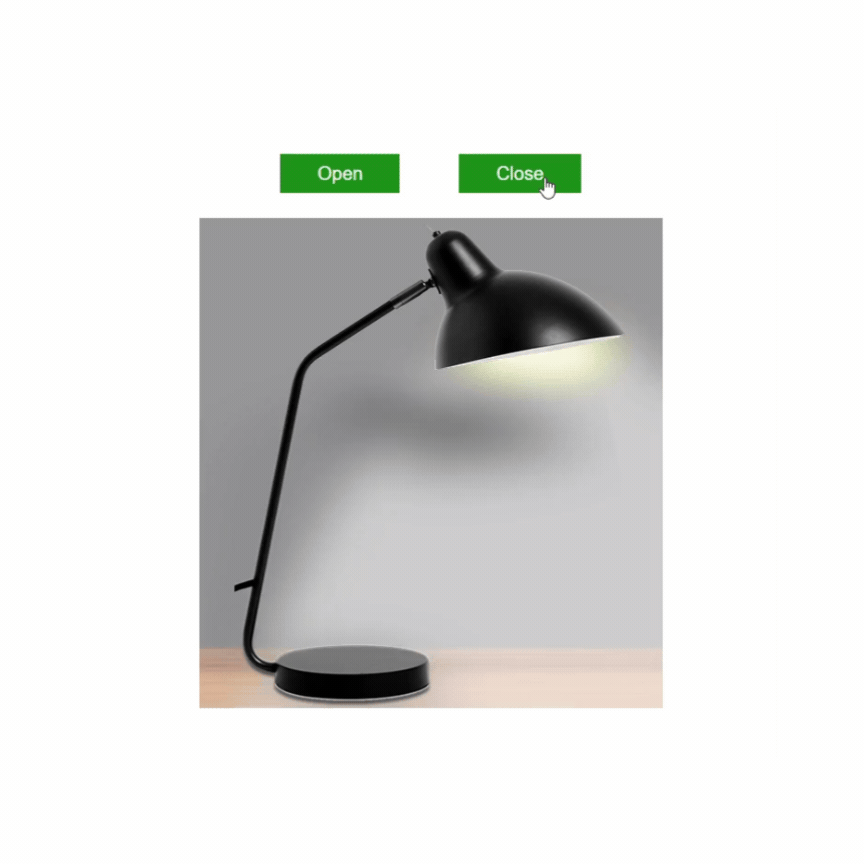

# 💡 Light On, Light Off 💡

This simple project is a web application that allows you to turn a light on and off.
The user can click two links to either open or close the light.

## 💼 Sunum

##  🎉 Using the Project
- **💡Click the "Open" link to turn the light on. 💡
- **🔌Click the "Close" link to turn the light off. 🔌
